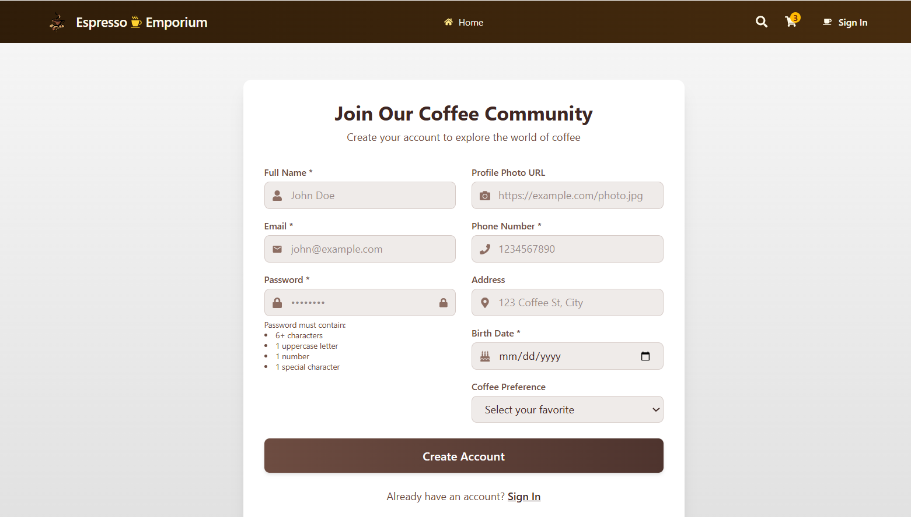

# Coffee Project ☕️

A Firebase-authenticated coffee ordering web application built with modern web technologies. Users can register, login, and enjoy a smooth UI experience.

## 🔗 Live Demo

Check out the live version of the project here:  
👉 [Live Demo](https://coffee-project-auth-fb3c5.web.app)

## 🔐 Features

- User authentication (Email/Password & Social Login)
- Firebase integration
- Responsive UI
- Clean design
- Protected routes
- Logout functionality

## 🛠️ Tech Stack

- React.js
- Firebase Authentication
- Tailwind CSS
- DaisyUI
- React Router
- Express Js
- MongoDB 

## 📸 Screenshots

